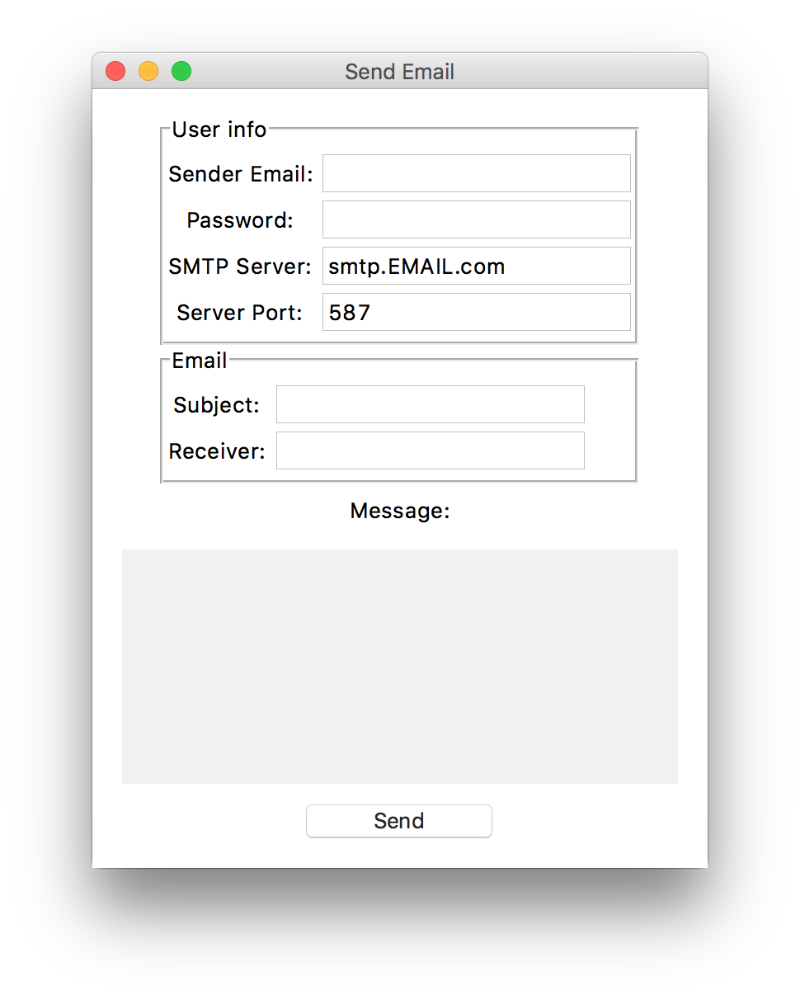

# SendEmailPython

A GUI program to send emails using the `smtplib` Python library and `tkinter` for the UI.

There is a `setup.py` file with a Makefile in case you want to make a macOS app from the script.

